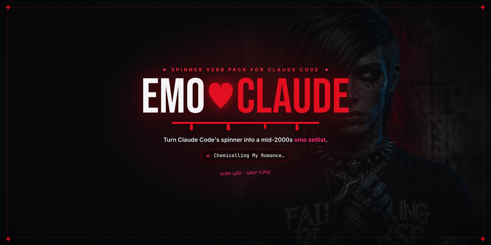

<div align="center">



<br><br>

**Turn Claude Code's spinner into a mid-2000s emo setlist.**

Instead of watching Claude *Frolicking…* or *Percolating…*, watch it
**Chemicalling My Romance…**, **Marching in the Black Parade…**, or
**Making Damn Sure…** while it works.

[](LICENSE)
&nbsp;
&nbsp;

<p></p>

<a href="https://russellenvy.github.io/emo-claude/"><b>russellenvy.github.io/emo-claude</b></a>

<p>By <a href="https://russellenvy.com">RUSSΞLL AARØN</a></p>

</div>

---

Every verb is a real emo/scene/pop-punk **band name, song title, or album** bent
into a gerund. Escape the Fate → *Escaping My Fate*. My Chemical Romance →
*Chemicalling My Romance*. "I Write Sins Not Tragedies" → *Writing Sins, Not
Tragedies*. *Bleed American* → *Bleeding American*.

---

## How it works

Claude Code (v2.x) supports a first-class setting for custom spinner words. No
binary patching, no wrappers — it's just a key in `~/.claude/settings.json`:

```json
{
  "spinnerVerbs": {
    "mode": "append",
    "verbs": ["Chemicalling My Romance", "Escaping My Fate", "..."]
  }
}
```

- `"mode": "append"` — adds the emo verbs **on top of** Claude's built-in defaults.
- `"mode": "replace"` — shows **only** the emo verbs.

Because it lives in your home-directory config, it **survives Claude Code
updates** — unlike anything that edits the app itself.

> [!NOTE]
> **`spinnerVerbs` is currently undocumented.** It's real and works (it's
> described inside the Claude Code binary and honored by the app), but it isn't
> in the public settings docs yet — so a future version could rename or remove
> it.

### Where it works

- ✅ **Claude Code terminal CLI** (`claude` in Terminal / iTerm) — macOS, Linux,
  and Windows. This is the confirmed surface: the emo gerunds *are* Claude Code's
  terminal "thinking" spinner.
- ❌ **The "Claude" desktop app** (`~/Library/Application Support/Claude/`) —
  confirmed no effect. Even though it can run Claude Code sessions through the
  Agent SDK, its loading/status indicator is the **app's own custom UI
  component**, not the terminal spinner that reads `spinnerVerbs` — and it keeps
  a separate `config.json`. So the setting is correctly installed but simply
  isn't what draws that indicator.
- ❌ **IDE extensions / other GUI surfaces** — same reason: they don't render the
  terminal gerund spinner, so there's nothing for the setting to swap. (If you
  ever *do* see gerunds like *Puzzling…* in one, EMO-Claude would apply there
  too — but the terminal is the sure thing.)

**TL;DR:** run `claude` in a real terminal to see it. GUI surfaces draw their own
status UI and won't show the emo verbs.

---

## Install

### Option A — one command (macOS / Linux) — recommended

```bash
git clone https://github.com/russelleNVy/emo-claude.git
cd emo-claude
./install.sh              # append to the defaults
# or
./install.sh --replace   # emo verbs only
```

The installer backs up your existing `settings.json` first, then merges with
`jq`. Restart Claude Code and start a task to see it.

> [!IMPORTANT]
> **Windows:** `install.sh` is a bash script — run it under **WSL** or **Git
> Bash** (both give you `bash` + `jq`). In plain `cmd`/PowerShell it won't run,
> so use **Option B** or **Option C** instead. Your settings file lives at
> `%USERPROFILE%\.claude\settings.json`.

Uninstall any time:

```bash
./install.sh --uninstall
```

### Option B — let Claude do it

Open Claude Code and paste:

> Add the verbs from `verbs.json` in this repo to my `~/.claude/settings.json`
> under `spinnerVerbs` with `"mode": "append"`.

### Option C — by hand

Copy the array from [`verbs.json`](./verbs.json) into the `spinnerVerbs.verbs`
field shown above. Your settings file is at `~/.claude/settings.json` (macOS /
Linux) or `%USERPROFILE%\.claude\settings.json` (Windows). This route works on
every platform.

---

<div align="center">

<br>
<sub><i>your new spinner — feeling everything, shipping anyway.</i></sub>
</div>

---

## The setlist

A taste of what's in [`verbs.json`](./verbs.json) — **band names, song titles,
and album titles**, all bent into gerunds:

### Band names → gerunds
| Band | Spinner reads… |
|------|----------------|
| My Chemical Romance | Chemicalling My Romance… |
| Escape the Fate | Escaping My Fate… |
| Pierce the Veil | Piercing the Veil… |
| Bring Me the Horizon | Bringing the Horizon… |
| Death Cab for Cutie | Cabbing for Cutie… |
| Alexisonfire | Setting Alexis on Fire… |
| The Devil Wears Prada | Wearing Prada… |
| Dance Gavin Dance | Dancing, Gavin, Dancing… |
| Cobra Starship | Starshipping the Cobra… |
| Bullet for My Valentine | Loading a Bullet for My Valentine… |

### Song titles → gerunds
| Song | Spinner reads… |
|------|----------------|
| "Welcome to the Black Parade" | Marching in the Black Parade… |
| "I Write Sins Not Tragedies" | Writing Sins, Not Tragedies… |
| "Sugar, We're Goin Down" | Going Down Swinging… |
| "MakeDamnSure" | Making Damn Sure… |
| "Misery Business" | Doing Misery Business… |
| "King for a Day" | Kinging for a Day… |
| "Ohio Is for Lovers" | Loving in Ohio… |
| "The Middle" | Finding the Middle… |
| "This Ain't a Scene, It's an Arms Race" | Declaring This Ain't a Scene… |
| "Light 'Em Up" | Lighting 'Em Up… |

### Album titles → gerunds
| Album | Spinner reads… |
|-------|----------------|
| *Bleed American* (Jimmy Eat World) | Bleeding American… |
| *A Fever You Can't Sweat Out* (Panic!) | Sweating Out the Fever… |
| *Brand New Eyes* (Paramore) | Opening Brand New Eyes… |
| *They're Only Chasing Safety* (Underoath) | Chasing Safety… |
| *Ocean Avenue* (Yellowcard) | Cruising Ocean Avenue… |
| *Commit This to Memory* (Motion City Soundtrack) | Committing This to Memory… |

Full list: **[`verbs.json`](./verbs.json)** — a growing setlist.

---

## Contributing

The emo genre is deep. PRs adding more bands/songs are welcome — one rule:
**every entry must be a real band or song title, transformed into a gerund
(`-ing`) phrase.** Keep it readable at spinner width; punchy beats obscure.

---

## Requirements

- **Claude Code v2.x** (has the `spinnerVerbs` setting) — the terminal CLI is
  the confirmed surface; not the standalone Claude chat app
- **Platforms:** macOS, Linux, and Windows. The `install.sh` route needs
  `bash` + `jq`, so that's macOS/Linux (or WSL / Git Bash on Windows); Windows
  users can also use **Option B** or **Option C**, which need nothing extra
- `jq` for the installer (`brew install jq`) — or use Option B/C

## License

MIT. Band and song titles belong to their respective artists; this is a fan
tribute for a terminal spinner. Stay sad, ship code. 🖤
